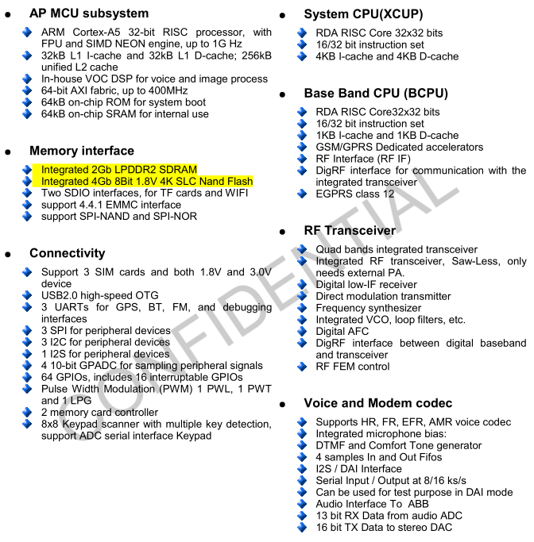

# [RDA8810](https://github.com/sochub/RDA8810) 

 

#### 归属：[cortex A5](https://github.com/sochub/CA5)

## [描述](https://github.com/sochub/RDA8810/wiki) 

RDA8810PL 使用40nm工艺，在单芯片上集成Cortex A5 单核处理器，拥有1GHz主频，专用的调制解调器，射频芯片以及能源管理系统，这个产品的集成度高，用于早期的手机，当前的性价比超高，是高性能MCU的理想替换者。

  

主要特点：集成256MB DDR2，集成512MB NAND Flash

功能特点：接口和功能全面，BOM成本低

主要短板：已发布很久

芯片封装：LFBGA 14mm X 16mm (325 balls)

#### [docs](docs/)

参考设计和数据手册

#### [linux](linux/)

linux系统构建资源

---

###  [SoC开发平台](http://www.qitas.cn)   

###  qitas@qitas.cn